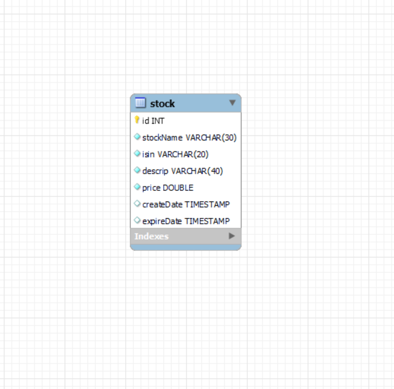

# sec_c_sec_c_joel.premkumar__corejava_project_2

  

## Stock Table

This table stores information about stocks.

| Column       | Data Type        | Constraints           | Description                  |
|--------------|------------------|-----------------------|------------------------------|
| id           | INT              | NOT NULL, PRIMARY KEY | Unique identifier           |
| stockName    | VARCHAR(30)      | NOT NULL, UNIQUE      | Name of the stock           |
| isin         | VARCHAR(20)      | NOT NULL              | ISIN (International Securities Identification Number) of the stock |
| descrip      | VARCHAR(40)      | NOT NULL              | Description of the stock    |
| price        | DOUBLE           | NOT NULL              | Price of the stock          |
| createDate   | DATE             | NOT NULL              | Date of creation            |
| expireDate   | DATE             | NOT NULL              | Date of expiration          |
| createTime   | TIME             | NOT NULL              | Time of creation            |
| expriedTime  | TIME             | NOT NULL              | Time of expiration          |
